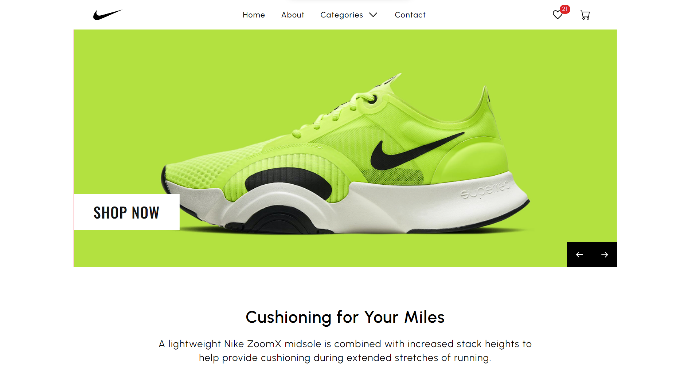

E-commerce Shoe Store
=====================

  

This is an e-commerce shoe store application where users can browse and purchase shoes online. The frontend is built with Next.js and Redux, while the backend is deployed on Render and utilizes Stripe for payments and Cloudinary for image storage. The PostgreSQL database is hosted on Render as well.

Live Project
------------

The live version of the project can be accessed [here](https://shoeup.vercel.app/).

Features
--------

-   Product Categories: The store offers a category section where users can browse shoes based on different categories.
-   Add to Cart: Users can add their desired shoes to the cart for easy checkout.
-   Add to Wishlist: Users can save their favorite shoes to the wishlist for future reference.
-   Size Selection: Users can select their preferred shoe size or update the size in the cart.
-   Quantity Management: Users can increase or decrease the quantity of shoes in the cart.
-   Secure Payments: The application integrates with Stripe for secure payment processing.
-   Image Storage: Shoe images are stored and managed using Cloudinary.

Technologies Used
-----------------

-   Frontend:

    -   Next.js
    -   Redux
    -   Other relevant packages (please add specific package names if applicable)
-   Backend:

    -   Render (for hosting the backend services)
    -   Stripe (for payment processing)
    -   Cloudinary (for image storage)
-   Database:

    -   PostgreSQL (hosted on Render)

Getting Started
---------------

To run the project locally, follow these steps:

1.  Clone the repository: `git clone https://github.com/yagyaraj234/shoe-ecommerce-website.git`
2.  Install the dependencies: `npm install`
3.  Configure the necessary environment variables for Stripe, Cloudinary, and PostgreSQL.
4.  Start the development server: `npm run dev`

Deployment
----------

The frontend of the application is deployed on Vercel, and the backend is hosted on Render. You can follow the deployment instructions provided by these platforms to deploy your application.

Contributions
-------------

Contributions to the project are welcome! If you find any issues or have ideas for improvements, feel free to open an issue or submit a pull request.

License
-------

This project is licensed under the [MIT License](https://opensource.org/licenses/MIT).